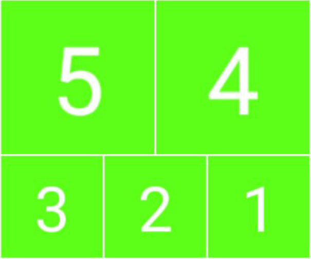

# QQ精选照片的图片切割器

## 软件架构
> Node.js + GraphicsMagick

## 介绍
> 这是一个针对QQ精选照片而开发的的图片切割器，用来一键切图  
> 当你看见别人QQ精选照片时，是否留意过那种伪九宫格呢?  
> 你细心观察，一张图片由1:1的图片组成，呈九宫格形状排布  
> 但神奇的是，组成大图的小图只有六张  
> 而你又不想折腾PS的时候，这个小工具就派上用场了  
> 使用它可以在2秒钟之内将图片切割完毕  

## 图例
> 项目里带了一些示例图片，你可以使用它来测试程序是否正常运行  
> 它们以 c 开头，后面的数字代表了`一张图片应该切割成几份`  
> 比如c6就是将宽高比1:1的图片切割成总共6片的伪九宫格  
> 并且，`每张图片对应的数字，就是切好后上传图片的顺序`  
> **注意**：要一张一张的传，例子：  
> 

## 安装教程
> ### 小白安装：  
>> 在 [Releases](https://gitee.com/nekokecore/QQ-Image-Cut/releases) 内下载打包好的文件 `QQ-Image-Cut.exe` ，然后双击 `解压` ，在 `新出现的文件夹` 里点 “`点我运行`” ，然后把 `要处理的图片` `拖拽` 过去，`回车`，然后再按照提示 `输入尺寸`， `回车` ，在` 图片所在地` 寻找成品即可  
>> 
>> **注意**：待处理的图片尽量按照 `附表` 的比例处理好，否则可能出现一些情况  
>  
>### 源码安装： 
>> 准备好 `Node.js` 环境  
>> 安装 `GraphicsMagick`  
>> `git clone https://gitee.com/nekokecore/QQ-Image-Cut`  
>> `cd QQ-Image-Cut`  
>> `npm i`
>> `node index`  

## [附表] 图片比例表  
> 
> | 规格 | 宽高比 | 浏览 |
> | :--- | :--- | :--- |
> |  C3  |  3:2  |    |
> |  C4  |  1:1  |    |
> |  C5  |  6:5  |    |
> |  C6  |  1:1  |    |
> |  C7  |  3:4  |    |
> |  C8  |  2:2.5  |    |
> |  C9  |  3:4  |    |